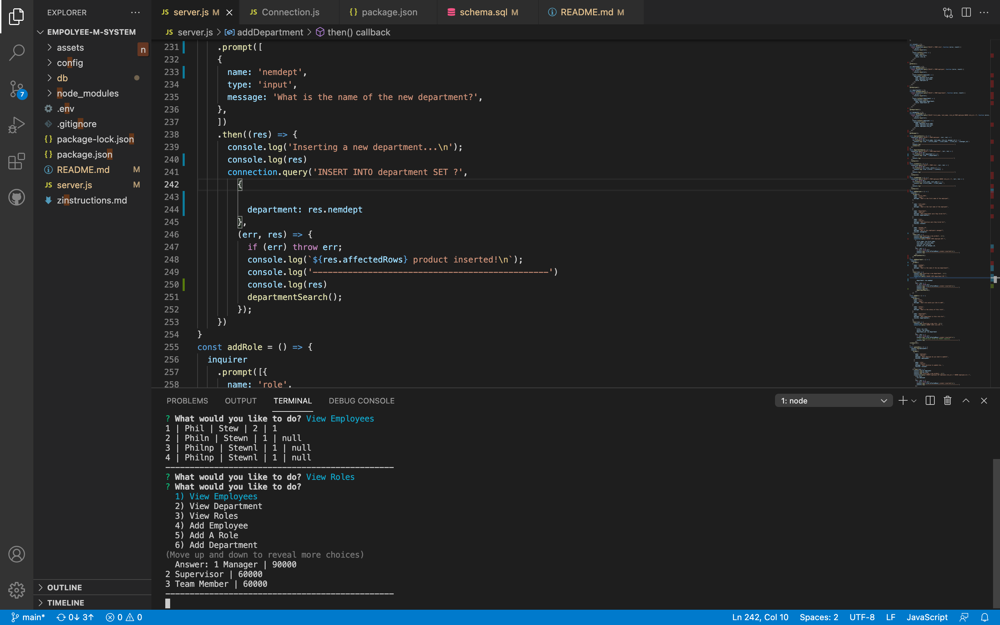
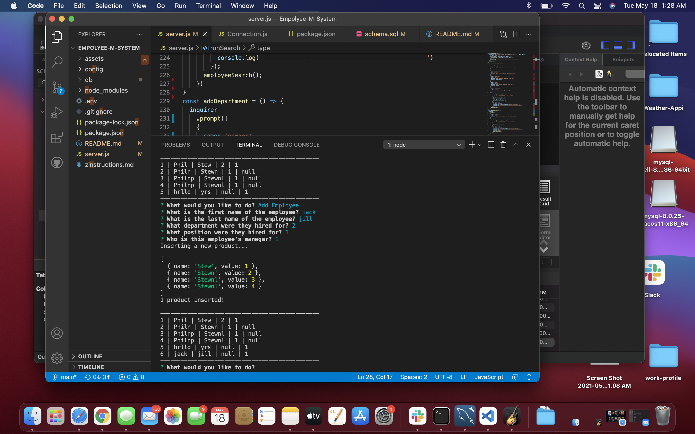
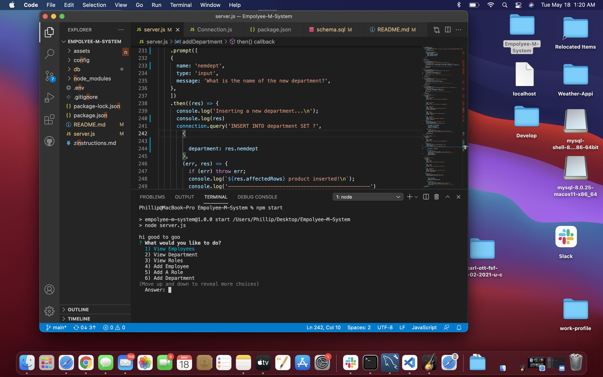
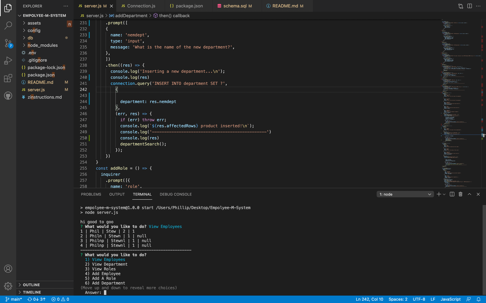

# Empolyee-M-System
An employee system for managing employees 

To start this application ypu can use 'npm start' or 'node index.js'

most my code is located in there server.js files.

In the application a user can add new roles, depmartments and new employees 

also the can view all employees, roles and departmants 

to view employees just follow just select VIEW EMPLOYEES from the option menu 

alist with all employees well appear. 

Same goes for the department and the roles.

also a user can change an employee's role by selecting the option to do so

it will display a list of current employees from which the user must chose 

then the user will be given a list from the availiable role to assign to the empolyee

Improvements need to be made so that a user can del roles, departments and employees 
 
 in the event an employee no longer works with the company 

also when uppdating an option to create a new role would help incase the use wants to assign an new non-exsisting role an employee   

